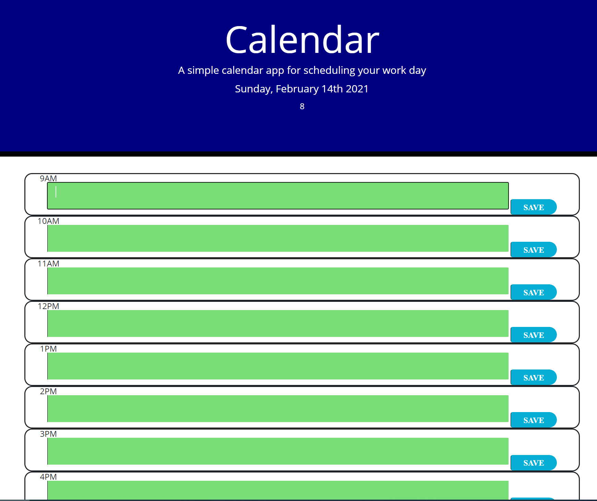
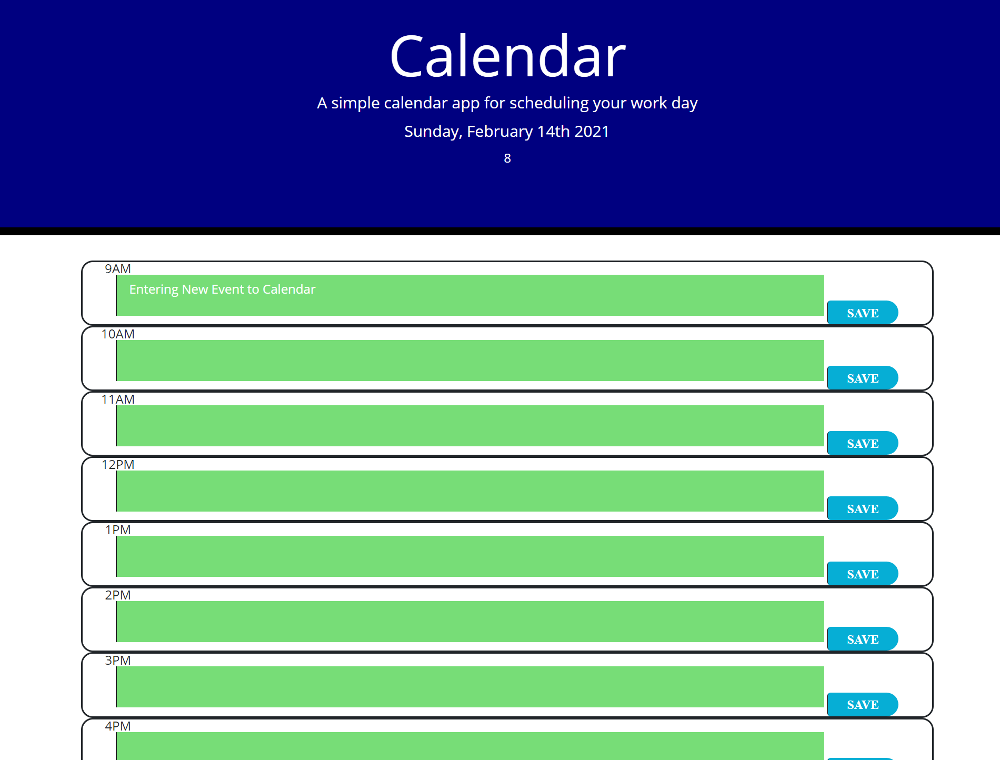
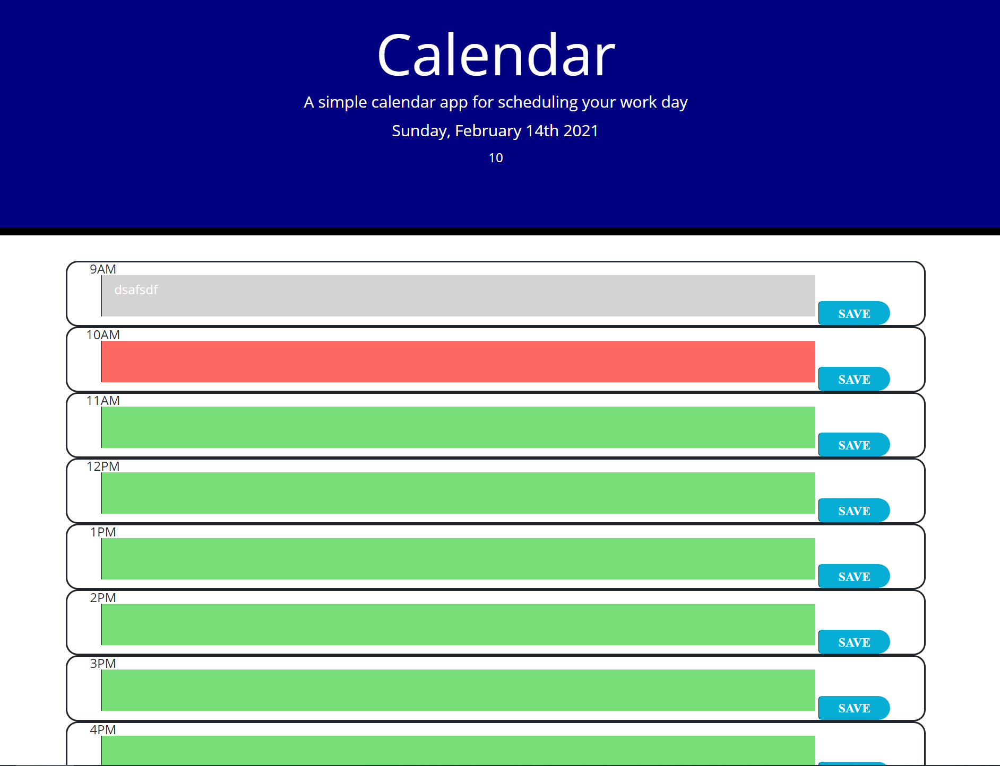

# DAILY PLANNER

* When loading your app the current day will be displayed.
The page will show all the timeblocks for a standard busness day.
Each timeblock should be color coded to indicate whether it is in the past, present, or future.
A user can enter an event by clicking on a timeblock.
Saving an event is saved in local storage.
Saved events will persist when refreshing or closing the browser.

## Usage / Directions
* Click the link to start getting organized! ==> https://brc9087.github.io/DailyPlanner/

## HOME PAGE
* 

 

## SAVING EVENTS
* 

 

## COLOR-CODED PAST, PRESENT, FUTRE
* 

 

## Tools Used / Dependancies
--
* HTML
* CSS
* JQUERY
* NPM NODE
* Github
* Moment JS

## Links
* APP: https://brc9087.github.io/DailyPlanner/
* REPO: https://github.com/brc9087/DailyPlanner
